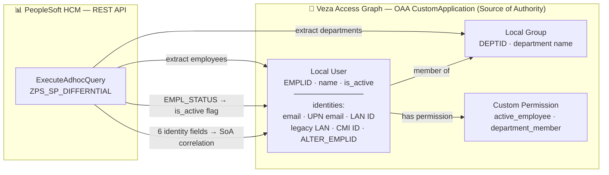

# PeopleSoft Diff — Veza OAA Integration

Connects to PeopleSoft HCM via its REST Web Services interface, fetches employee
records using the differential aggregation query (`ZPS_SP_DIFFERNTIAL`), and
pushes identity and access data into Veza's Access Graph using the OAA
(Open Authorization API) `CustomApplication` template.

---

## 1. Overview

| What | Detail |
|---|---|
| **Source system** | PeopleSoft HCM (REST Adhoc Query API) |
| **Auth method** | HTTP Basic (service account username / password) |
| **Query** | `ZPS_SP_DIFFERNTIAL` — returns all employees in the differential dataset |
| **Identity key** | `EMPLID` |
| **Veza provider type** | `CustomApplication` |

### OAA entity model

| PeopleSoft field(s) | OAA entity | Notes |
|---|---|---|
| `EMPLID` | `LocalUser.unique_id` | Primary key |
| `PREF_FIRST_NAME` / `FIRST_NAME` + `LAST_NAME` | `LocalUser.name` | Display name |
| `EMAIL_ADDR` | `LocalUser.identities[0]` | **SoA** — primary email correlation |
| `ZPS_UPNE_EMAILID` | `LocalUser.identities[1]` | **SoA** — UPN / secondary email |
| `ZPS_LAN_ID` | `LocalUser.identities[2]` | **SoA** — LAN / AD username |
| `ZPS_LEG_LANID` | `LocalUser.identities[3]` | **SoA** — legacy domain username |
| `ZPS_CMI_ID` | `LocalUser.identities[4]` | **SoA** — CMI system identifier |
| `ALTER_EMPLID` | `LocalUser.identities[5]` | **SoA** — alternate / pre-merger EMPLID |
| `EMPL_STATUS` ∈ {A, L, P, S} | `LocalUser.is_active = True` | Active employee |
| `DEPTID` + `DESCR` | `LocalGroup.unique_id` / `.name` | Department group |
| Group membership | `active_employee` permission | App-level, active only |
| Group membership | `department_member` permission | App-level |

### Custom permissions

| Permission | OAA mapping | Granted to |
|---|---|---|
| `active_employee` | `DataRead` | Active employees (EMPL_STATUS ∈ {A,L,P,S}) |
| `department_member` | `DataRead` | All employees assigned to a department |

---

## 2. Entity Relationship Map



---

## 3. How It Works

1. `load_config()` reads credentials from `.env` / environment variables / CLI flags.
2. `fetch_employees()` POSTs the differential aggregation XML body to
   `{PEOPLESOFT_BASE_URL}/PSIGW/RESTListeningConnector/PSFT_HR/ExecuteAdhocQuery.v1/executeadhocquery`
   using HTTP Basic auth.
3. `_parse_xml_response()` iterates all `<row>` elements (any namespace) in the
   XML response and strips PeopleSoft table alias prefixes (e.g. `A.EMPLID` → `EMPLID`).
4. `build_oaa_payload()` creates a `CustomApplication` with local users (one per
   `EMPLID`) and local groups (one per unique `DEPTID`). Users are assigned to their
   department group and given `active_employee` / `department_member` permissions.
5. `push_to_veza()` calls `OAAClient.push_application()` with `create_provider=True`
   so the provider is created automatically on first run.

---

## 4. Prerequisites

| Requirement | Version |
|---|---|
| Python | ≥ 3.9 |
| oaaclient | ≥ 1.1.0 |
| Network access | HTTPS from host to PeopleSoft and to Veza |
| PeopleSoft | HCM with REST Adhoc Query listener enabled on the target port |
| Veza | API key with OAA write permission |

---

## 5. Quick Start (one-command installer)

```bash
curl -fsSL https://raw.githubusercontent.com/your-org/peoplesoft-diff-veza/main/integrations/peoplesoft-diff/install_peoplesoft_diff.sh | bash
```

The installer will prompt you for:
- PeopleSoft base URL (e.g. `https://your-peoplesoft-host.example.com:5043`)
- PeopleSoft service account username
- PeopleSoft service account password
- Veza instance URL
- Veza API key

---

## 6. Manual Installation

### RHEL / CentOS / Amazon Linux

```bash
# Install system prerequisites
sudo dnf install -y git python3 python3-pip
python3 -m venv --help &>/dev/null || sudo dnf install -y python3-virtualenv

# Clone repository
git clone --depth 1 https://github.com/your-org/peoplesoft-diff-veza.git /tmp/ps-diff-veza

# Create install directories
sudo mkdir -p /opt/VEZA/peoplesoft-diff-veza/scripts /opt/VEZA/peoplesoft-diff-veza/logs
sudo chown -R "$(id -un)" /opt/VEZA/peoplesoft-diff-veza

# Copy integration files
cp /tmp/ps-diff-veza/integrations/peoplesoft-diff/peoplesoft_diff.py \
   /tmp/ps-diff-veza/integrations/peoplesoft-diff/requirements.txt \
   /tmp/ps-diff-veza/integrations/peoplesoft-diff/.env.example \
   /opt/VEZA/peoplesoft-diff-veza/scripts/

# Create venv and install dependencies
python3 -m venv /opt/VEZA/peoplesoft-diff-veza/scripts/venv
/opt/VEZA/peoplesoft-diff-veza/scripts/venv/bin/pip install -r \
    /opt/VEZA/peoplesoft-diff-veza/scripts/requirements.txt

# Configure credentials
cp /opt/VEZA/peoplesoft-diff-veza/scripts/.env.example \
   /opt/VEZA/peoplesoft-diff-veza/scripts/.env
chmod 600 /opt/VEZA/peoplesoft-diff-veza/scripts/.env
nano /opt/VEZA/peoplesoft-diff-veza/scripts/.env
```

### Ubuntu / Debian

```bash
sudo apt-get update && sudo apt-get install -y git python3 python3-pip python3-venv
# Then follow the same steps as RHEL above from "Clone repository" onward.
```

---

## 7. Usage

```
usage: peoplesoft_diff.py [-h] [--peoplesoft-url URL] [--peoplesoft-username USER]
                           [--peoplesoft-password PASS] [--veza-url URL]
                           [--veza-api-key KEY] [--provider-name PROVIDER_NAME]
                           [--datasource-name DATASOURCE_NAME] [--env-file ENV_FILE]
                           [--dry-run] [--save-json]
                           [--log-level {DEBUG,INFO,WARNING,ERROR}]
```

| Argument | Required | Default | Description |
|---|---|---|---|
| `--env-file` | No | `.env` | Path to configuration file |
| `--peoplesoft-url` | * | `PEOPLESOFT_BASE_URL` | PeopleSoft HCM base URL with port |
| `--peoplesoft-username` | * | `PEOPLESOFT_USERNAME` | Service account username |
| `--peoplesoft-password` | * | `PEOPLESOFT_PASSWORD` | Service account password |
| `--veza-url` | * | `VEZA_URL` | Veza instance URL |
| `--veza-api-key` | * | `VEZA_API_KEY` | Veza API key |
| `--provider-name` | No | `PeopleSoft HR` | Provider name in Veza UI |
| `--datasource-name` | No | `PeopleSoft Differential` | Data source name in Veza UI |
| `--dry-run` | No | `false` | Build payload without pushing |
| `--save-json` | No | `false` | Save payload JSON for inspection |
| `--log-level` | No | `INFO` | Log verbosity |
| `--state-file` | No | `known_employees.jsonl` | Persistent known-employee state file. Differential runs merge fetched records into it (adds/updates only, never removes); full-sync runs replace it entirely. This is what each push is built from, so unchanged users are never dropped. |

*Required via CLI flag, environment variable, or `.env` file.

### Examples

```bash
# Dry run using .env defaults
cd /opt/VEZA/peoplesoft-diff-veza/scripts
./venv/bin/python3 peoplesoft_diff.py --dry-run --save-json

# Full push with explicit .env file
./venv/bin/python3 peoplesoft_diff.py --env-file /etc/veza/peoplesoft.env

# Override provider name
./venv/bin/python3 peoplesoft_diff.py --provider-name "HR PeopleSoft" \
    --datasource-name "PeopleSoft HCM Prod"

# Debug mode
./venv/bin/python3 peoplesoft_diff.py --log-level DEBUG --dry-run --save-json
```

---

## 8. Deployment on Linux

### Service account

```bash
sudo useradd -r -s /bin/bash -m -d /opt/VEZA/peoplesoft-diff-veza peoplesoft-diff-veza
sudo chown -R peoplesoft-diff-veza: /opt/VEZA/peoplesoft-diff-veza
```

### File permissions

```bash
chmod 700 /opt/VEZA/peoplesoft-diff-veza/scripts
chmod 600 /opt/VEZA/peoplesoft-diff-veza/scripts/.env
```

### SELinux (RHEL)

```bash
# Check enforcement mode
getenforce

# Restore default contexts after copying files
restorecon -Rv /opt/VEZA/peoplesoft-diff-veza/
```

### Cron wrapper script

Create `/opt/VEZA/peoplesoft-diff-veza/run_integration.sh`:

```bash
#!/usr/bin/env bash
set -euo pipefail
SCRIPTS_DIR="/opt/VEZA/peoplesoft-diff-veza/scripts"
LOGS_DIR="/opt/VEZA/peoplesoft-diff-veza/logs"
exec "${SCRIPTS_DIR}/venv/bin/python3" "${SCRIPTS_DIR}/peoplesoft_diff.py" \
    --log-level INFO >> "${LOGS_DIR}/cron.log" 2>&1
```

```bash
chmod +x /opt/VEZA/peoplesoft-diff-veza/run_integration.sh
```

### Cron schedule (`/etc/cron.d/peoplesoft-diff-veza`)

```cron
# Run PeopleSoft Diff -> Veza OAA integration daily at 06:00
0 6 * * * peoplesoft-diff-veza /opt/VEZA/peoplesoft-diff-veza/run_integration.sh
```

### Log rotation (`/etc/logrotate.d/peoplesoft-diff-veza`)

```
/opt/VEZA/peoplesoft-diff-veza/logs/*.log {
    daily
    rotate 30
    compress
    missingok
    notifempty
    su peoplesoft-diff-veza peoplesoft-diff-veza
}
```

---

## 9. Multiple Instances

To run against multiple PeopleSoft environments (e.g. prod and non-prod):

```bash
# Production
./venv/bin/python3 peoplesoft_diff.py \
    --env-file /etc/veza/peoplesoft-prod.env \
    --datasource-name "PeopleSoft HCM Prod"

# Non-production
./venv/bin/python3 peoplesoft_diff.py \
    --env-file /etc/veza/peoplesoft-nonprod.env \
    --datasource-name "PeopleSoft HCM NonProd"
```

Stagger cron schedules by 15+ minutes to avoid overlapping pushes.

---

## 10. Security Considerations

- Store `.env` with `chmod 600` and owned by the service account only.
- Rotate the Veza API key in Veza Settings > API Keys on a regular cadence.
- Rotate the PeopleSoft service account password and update `.env` accordingly.
- Use a dedicated service account in PeopleSoft with read-only access to the
  `ZPS_SP_DIFFERNTIAL` query.
- If the PeopleSoft server uses an internal CA certificate, set
  `REQUESTS_CA_BUNDLE=/path/to/ca-bundle.crt` in `.env`.
- Never commit `.env` to version control — it is listed in `.gitignore`.

---

## 11. Troubleshooting

| Symptom | Likely cause | Fix |
|---|---|---|
| `SSL verification failed` | Self-signed / internal CA cert | Set `REQUESTS_CA_BUNDLE` to your CA bundle path |
| `Connection failed` | Wrong base URL or firewall | Verify `PEOPLESOFT_BASE_URL` and test network connectivity |
| `HTTP 401` | Bad credentials | Check `PEOPLESOFT_USERNAME` / `PEOPLESOFT_PASSWORD` |
| `HTTP 404` | Wrong endpoint path | Verify the Integration Broker listener is enabled and the URL path is correct |
| `No employee records returned` | Empty differential dataset or query not deployed | Run a test connection query in PeopleSoft to verify the query returns data |
| `Veza push failed: HTTP 401` | Invalid or expired API key | Regenerate the Veza API key and update `.env` |
| `ModuleNotFoundError: oaaclient` | Not using venv | Activate the venv: `source venv/bin/activate` |
| Log files not created | `logs/` directory missing | The script auto-creates `logs/` on first run; ensure write permission |

Check log files in `logs/` for detailed diagnostics at `--log-level DEBUG`.

---

## 12. Changelog

| Version | Date | Notes |
|---|---|---|
| 1.0 | 2026-07-20 | Initial release — differential aggregation via ZPS_SP_DIFFERNTIAL |
